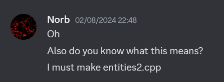
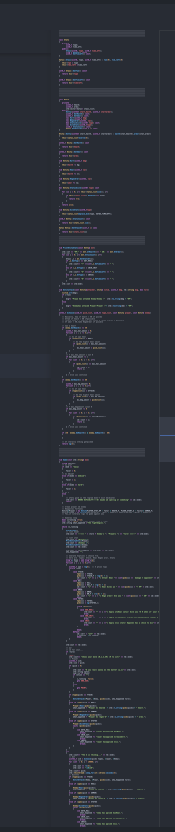
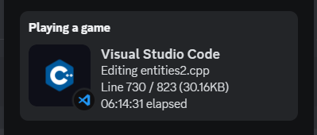

<h1>ENTITIES!</h1>

Now, you may be thinking... 
<b>Norb, wtf is this?</b> 
entities2.cpp is a little silly CLI game with turn based combat I made in 2 days!

<h1>How to compile?</h1>

To compile enities.cpp, see it's compile instructions <a href="entities1\README.md">here</a>. 
To compile enities2.cpp, see it's compile instructions <a href="entities2\README.md">here</a>.

<h1>The backstory</h1>

It was the year 2022, and I have made a simple shrimple test file 
for testing C++ pass-by-reference. Because back then, I was just starting out.
  
Time skip to <b>30th of July, 2024</b>, I have sent the entities.cpp file 
in a group chat with my good friends <a href="https://github.com/MF366-Coding">MF366</a> and <a href="https://github.com/MaybeHawk1">MaybeHawk</a>,  and then MaybeHawk decided to compile it. That's when it all began...  
On 2nd of August, while me and MaybeHawk have been messing around, I have said the following words: 
</img> 
These words have propelled the development of <i>entities2.cpp</i>. 
I began brainstorming and coming up with ideas. And I feel like I cooked well. 
Here is a picture from development: </img> Don't zoom on it, just enjoy it from afar.  
As a little tiny joke, I have added goto's and heap allocation to this game as well, 
because who doesn't love those, amirite? 
After 2 days of development, the game was officialy complete at 4th of August, about 30 minutes past midnight. 
The development was long and hard ( ͡° ͜ʖ ͡°) in fact, before I finished it completely, I have coded for: 
</img> 
However, it was worth every second.
I hope you enjoy it as much as I enjoyed making it!!! 
License inside the entities2/ folder.  
Anyway, go PLAY THE GAME!!!!! :)

