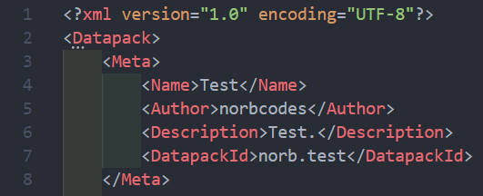
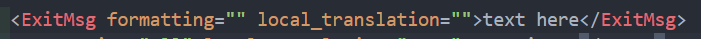
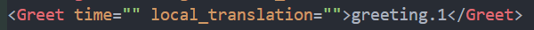
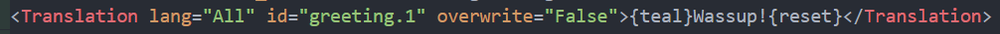

@page DATAPACK_DOC Datapack Documentation

This page will explain how Datapacks work, and how you can make your own.

<ul>
    <li>
    <a href="#1">What is a Datapack?</a>
    <ul>
        <li>
        <a href="#1.1">What type of file are they?</a>
        </li>
        <li>
        <a href="#1.2">How are they loaded in game?</a>
        </li>
    </ul>
    </li>
    <li>
    <a href="#2">Structure</a>
    <ul>
        <li>
        <a href="#2.1">"Datapack" block</a>
        </li>
        <li>
        <a href="#2.2">"Meta" block</a>
        </li>
        <li>
        <a href="#2.3">"Data" block</a>
        <ul>
            <li>
            <a href="#2.3.1">Exit Message block</a>
            </li>
            <li>
            <a href="#2.3.2">Greet block</a>
            </li>
            <li>
            <a href="#2.3.3">Translation block</a>
            </li>
        </ul>
        </li>
    </ul>
    </li>
</ul>

<h1>What is a Datapack?</h1>

A Datapack at its current state can add custom exit messages and custom greetings, 
as well as make custom translations or port the entire game to other languages!  
Sure, doesn't sound too exciting, but who doesn't love a bit of customization eh? ;)

<h2>What type of file are they?</h2>

Datapacks are <b>XML documents</b>. These files can be placed in the Datapack folder 
which is usually in the same folder as the exe itself. (You can change where the datapack folder 
is with the <code>-nd</code> command line argument).

<h2>How are they loaded in game?</h2>

Datapacks are only loaded once on startup. This means making a change to a Datapack 
requires you to exit from the game to apply the changes. 
Faulty Datapacks will also display an error in the Datapacks tab.

<h1>Structure</h1>

A Datapack consists of 3 main blocks.

<h2>"Datapack" block</h2>

The very first block that contains all of datapack info. 
Both "Meta" and "Data" blocks fall under this one.

<h2>"Meta" block</h2>

This block contains data about the Datapack. This block is absolutely required. 
It contains 4 necessary nodes:
<ul>
<li><b>Name</b> - Name of the Datapack.</li>
<li><b>Autor</b> - Who made the Datapack.</li>
<li><b>Description</b> - A small (or big) description of the Datapack.</li>
<li><b>DatapackId</b> - Special identifier.</li>
</ul>
If any of these are missing, the Datapack will not be loaded.  
This is how it looks like: 
</img>

<h2>"Data" block</h2>

This is where the actual data in the Datapack is!

<h3>Exit Message block</h3>
</img>

This one, as seen there, adds a custom exit message! 
In the body, you can add your exit message, or you can add a translation key for localized 
strings.  
This is where the parameter <code>local_translation</code> comes in. 
If this is set to <code>"True"</code>, then it will only take translations from within the datapack itself, 
else it uses global translations. 
Parameter <code>formatting</code> states wheter the exit message should be formatted or not. 
If set to <code>"True"</code>, you can then use <code>{white}</code> or <code>{blue}</code> and other formatting tags.

<h3>Greet block</h3>
</img>

This adds a custom greeting. Putting a translation string in the body works the same way as previously 
Both <code>formatting</code> and <code>local_translation</code> work the same as previously. 
Only new attribute is <code>time</code>. This specifies the time when the greeting can appear. 
Possible values are: Morning, Afternoon, Evening, EarlyNight, 3AM, All 

<h3>Translation block</h3>
</img>

Now for the star of this show: translation blocks!!! 
In the body of this block, it's the string. Simple.  
<code>lang</code> attribute here is what language this belongs to. 
All language codes used by entities2 are <code>en-US</code>, <code>sk-SK</code>, <code>ru-RU</code>, <code>tl-PH</code> and <code>pt-PT</code>. The first two letters are set by ISO 639 norm, and the last two are set by ISO 3166-2 norm.  
<code>id</code> attribute here is the translation key, like <code>menu.main.subtitle</code> or <code>general.on</code> for example.  
<code>overwrite</code>, if set to True, means that the translation is overwritting global translations. If set to False,
 it will not affect translations and will be local to the Datapack.

